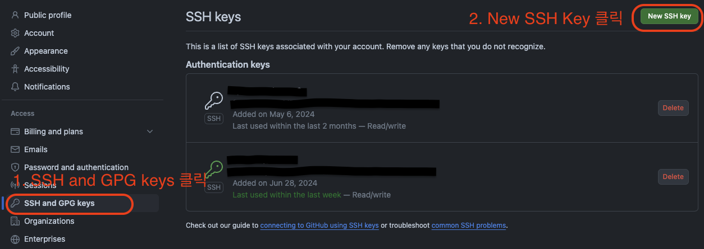
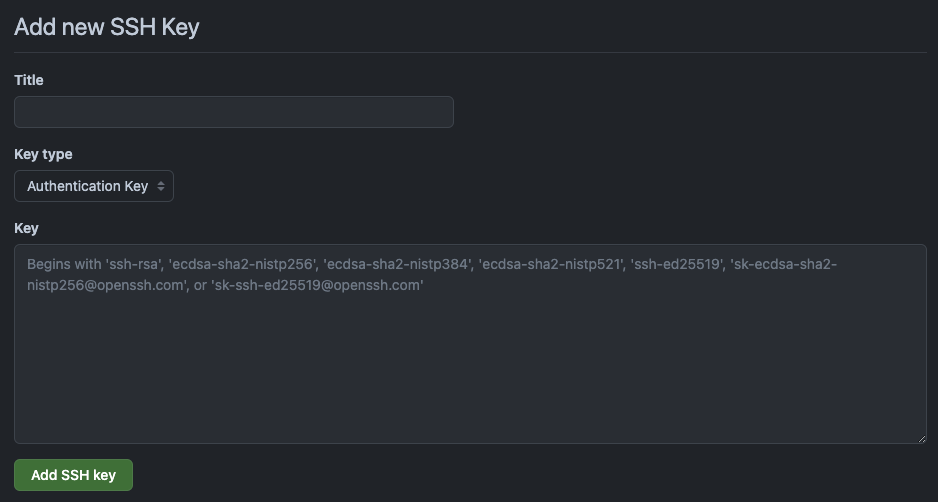

저는 Github 계정이 회사용/개인용이 각각 있습니다.
회사 맥북으로 개인 프로젝트를 진행하려 했고, git 설정은 회사용 Github 계정으로 셋팅되어 있었습니다.
개인 프로젝트에서는 개인용 계정으로 커밋 내역을 기록하고 싶었고 방법이 있어서 정리해보았습니다.

## SSH key 생성
터미널을 열어 `~/.ssh`에 접속 후 아래 명령어를 입력합니다.
ssh 키 쌍을 생성하는 명령어입니다. 회사용/개인용 각각 만들어줍시다.
```bash
cd ~/.ssh

# ssh-keygen -t rsa -C "이메일" -f "파일명"
ssh-keygen -t rsa -C "work@gmail.com" -f "work"
ssh-keygen -t rsa -C "personal@gmail.com" -f "personal"
```

아래와 같이 나올텐데 암호는 입력하지 않아도 됩니다. 
엔터를 두 번 누릅니다.
```terminal
> Generating public/private ALGORITHM key pair.
Enter passphrase (empty for no passphrase):
Enter same passphrase again:
```

```terminal
Your identification has been saved in work
Your public key has been saved in work.pub
The key fingerprint is:
SHA256:L1Pnok/ipcy06RWrp0HMer5xYusFejBDykAJbCD0Vvs work@gmail.com
The key's randomart image is:
+---[RSA 3072]----+
|Bo.. .           |
|.+o . .          |
|. .o ..          |
|  .o o.o         |
|    o +ES o .    |
|       B + =     |
|      o % X .    |
|       X ^..     |
|       o^=.      |
+----[SHA256]-----+
```

키 쌍이 제대로 생성되었는지 확인합니다.
회사용/개인용으로 public/private key 총 4개가 생성되었다면 성공입니다.
```bash
ls 
# > personal personal.pub work work.pub
```

## 생성한 key를 ssh-agent에 등록
백그라운드에서 ssh-agent를 시작합니다.
```bash
eval "$(ssh-agent -s)"
# > Agent pid 59566
```

ssh 접속정보를 config로 등록하여 간판하게 ssh 접속할 수 있도록 `~/.ssh/config`를 작성합니다.
ssh-agent는 키를 자동으로 로드하고 키 집합에 암호를 저장할 수 있습니다.
```bash
vi ~/.ssh/config
```

아래 내용을 입력해줍니다. 달라지는 내용은 두 개입니다.
- `Host` - ssh 명령에 사용할 이름입니다.
- `IdentityFile` - ssh key 위치입니다.
```text
# 업무용 계정
Host github.com
   HostName github.com
   User git
   AddKeysToAgent yes
   UseKeychain yes
   IdentityFile ~/.ssh/work
   
# 개인용 계정
Host github.com-personal
   HostName github.com
   User git
   AddKeysToAgent yes
   UseKeychain yes
   IdentityFile ~/.ssh/personal
```

ssh-agent에 ssh private key를 추가해줍니다.
```bash
ssh-add ~/.ssh/work
ssh-add ~/.ssh/personal
```

## GitHub의 계정에 SSH 퍼블릭 키를 추가
회사용/개인용 Github 계정 둘 다 아래 절차를 진행해야 합니다.

ssh public key를 복사합니다.
```bash
pbcopy < ~/.ssh/work.pub
```

github.com > 오른쪽 상단에 프로필 클릭 > Settings 클릭합니다.


좌측 메뉴에 SSH and GPG Keys 클릭 > New SSH Key 클릭합니다.

입력할 수 있는 화면이 나타납니다. 
- `Title` - ssh key에 대한 간단한 설명을 적습니다.
- `Key` - 복사했던 내용을 붙여넣기합니다.



`Add SSH Key` 버튼을 클릭하여 public key를 등록합니다.

ssh 설정은 완료되었습니다. ssh 연결 테스트를 해보고 싶다면 아래 명령어를 입력합니다.
```bash
# ssh -T git@[~/.ssh/config에서 설정한 Host]

ssh -T git@github.com

ssh -T git@github.com-personal
```

경고가 표시될 수 있는데 key fingerprint가 public key fingerprint와 일치하는지 확인하고 yes를 입력하면 됩니다.
이후 연결되었다면 터미널에 결과가 이렇게 나올겁니다.
```text
Hi [username]! You've successfully authenticated, but GitHub does not provide shell access.
```


## 폴더에 따른 .gitconfig 설정
전역 `.gitconfig` 설정으로 프로젝트가 속한 폴더에 따라 git 설정을 변경할 수 있습니다.
앞서 말씀드렸다시피 저는 개인용 계정으로 커밋 Author를 남기고 싶었기에 user 정보를 설정해주었습니다.
`.gitconfig` 내용을 다음과 같이 수정해 줍니다.
```bash
vi ~/.gitconfig
```
```text {4-5}
[user]
	name = 회사 Github 이름
	email = 회사 Github 이메일
[includeIf "gitdir:~/personal_workspace/"]
	path = ~/personal_workspace/personal_workspace.inc

(추가설정들...)
```

이후 `~/personal_workspace/personal_workspace.inc` 위치에 user 정보를 작성합니다.
```bash
vi ~/personal_workspace/personal_workspace.inc
```
```text {4-5}
[user]
	name = junseokku
	email = asegh12@gmail.com
```

개인 프로젝트를 `~/personal_workspace/` 하위에서 관리하면 이 걱정은 이제 문제 없습니다.

## 동작 확인
모든 설정이 끝났습니다. 이제 동작이 제대로 되는지만 확인하면 됩니다.

`git clone`, `git fetch`, `git pull`처럼 일부 git 명령어를 사용할 땐 원격 저장소가 필요합니다.
원격 저장소는 url으로 지정할 수 있는데 문법이 있습니다. 
url은 프로토콜은 포함해야 합니다. 
프로토콜 중에 저희가 설정했던 걸 이용할 수 있는 건 `git` 혹은 `ssh`입니다. 
여기서는 `git`에 대해서만 다루겠습니다.
자세한 건 [git 공식문서](https://git-scm.com/docs/git-clone#_git_urls)에 나와 있습니다.

저희가 url에 적용할 문법은 아래와 같습니다.
- `git://<host>[:<port>]/<path-to-git-repo>`
  - `<host>` - `~/.ssh/config`에서 설정했던 `Host`를 넣어주면 됩니다. 
  - `[:<port>]` - 생략해도 됩니다.
  - `<path-to-git-repo>` - 저장소 위치를 넣어줍니다.

예시로는 이렇게 될 수 있겠네요. 제 블로그 원격 저장소 url을 사용한 예시입니다.
- `git://github.com-personal/junseokku/junseokku-dev.git`

만약 기존 프로젝트에 원격 저장소 url을 변경한다면 이렇게 하면 됩니다.
```bash
git remote set-url origin git://github.com-personal/junseokku/junseokku-dev.git

# 확인
git remote -v
```

새로 프로젝트를 clone 받는 것도 마찬가지입니다.
```bash
git clone git://github.com-personal/junseokku/junseokku-dev.git
```

따라서 아래 사항들만 유의하며 사용하면 됩니다.
- 원격 저장소에 접근할 땐, ssh 방식을 이용한다.
- url에선 `~/.ssh/config`에 설정된 Host를 이용한다.
- 프로젝트에서 접근하는 계정에 따라 원격 저장소를 제대로 설정하자.

## 참고 자료
- [새 SSH 키 생성 및 ssh-agent에 추가](https://docs.github.com/ko/authentication/connecting-to-github-with-ssh/generating-a-new-ssh-key-and-adding-it-to-the-ssh-agent#adding-your-ssh-key-to-the-ssh-agent)
- [git-clone#_git_urls](https://git-scm.com/docs/git-clone#_git_urls)
- [깃헙(Github) 계정을 개인용&업무용 분리하여 사용하기](https://steemit.com/hive-137029/@anpigon/20220605t141226727z)

